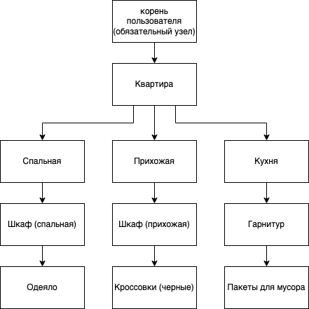
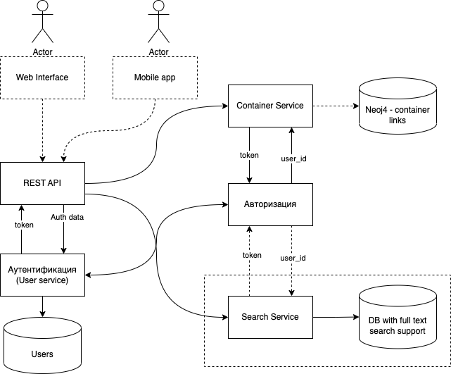

# Cyan project

Проект для курса "Архитектура компьютерных сетей"

## О проекте

Приложение для инвентаризации домашних вещей. Позволяет выстраивать древовидную структуру хранения вещей в доме и быстро находить
нужные вам вещи. Основной объект - контейнер

Пример:



## Архитектура



Есть два основных сервиса - Container service для управления контейнерами и User service для управления пользователями и
авторизации и аутентификации. Доступ клиентов осуществляется по протоколу HTTP через отдельный REST API service, который общается с основными сервисами
через grpc-вызовы. Для авторизации используются JWT-токены с ограниченным временем жизни и рефреш токены

## API

| Endpoint | Method | Body structure | Description | Example answer | Needed headers |
|----------|--------|----------------|-------------|----------------|----------------|
| /register | POST | ```{ "email": <user email>, "passord": <user password> }``` | Регистрирует нового пользователя по эл почте и паролю | ```{"user_id" : 0}``` | - |
| /login | POST | ```{ "email" <user email>, "password": <user password>}```| Выдает пользователю аутентификационные данные - jwt token и refresh token | ```{"token" : "eyJhbGciOiJIUzI1NiIsInR5cCI6Ikp...", "refresh_token": "eyJhbGciOiJIUzsasdfasdf...}``` | - |
| /refresh | POST | ```{ "old_token": <old token>, "refresh_token": <refresh token>"}``` | Обновляет аутентификационный токен пользователя | ```{"new_token" : "eyJhbGciOiJIUzI1NiIsInR5cCI6Ikp...", "refresh_token": "eyJhbGciOiJIUzI1NiIsInR5cCI6Ikp..."}```| - |
| /containers/ | POST | ```{"path" : <path> ,"container" : {"name" : <name> ,"is_leaf" : true,"meta_data" : {"key" : "val"}}}``` | Создает новый контейнер по пути ```<path>```. К контейнеру можно добавить метаданные (например ссылку на фото и т.д.) | ```{"created": true}``` | ```Authentication: Bearer <token>``` |
| /containers/ | GET | ```{"path" : <path>}``` | Получает данные о контейнере по пути ```<path>``` и всех вложенных в него контейнерах | ```{"path" : "/sonne","container" : {"name" : "sonne","is_leaf" : true,"meta_data" : {"key" : "val"}}, "inners" : {}}``` | ```Authentication: Bearer <token>``` |

## Планы

 - Использовать для хранения дерева контейнеров Neoj4
 - Реализовать сервис для поиска контейенров по словесному описанию (нужна бд с полнотекстовым поиском)
 - Реализовать сервис тегов для контейнеров для быстрого объединения контейнеров в группы по темам
 - Реализовать Web API как Single Page App на ReactJS
 - Реализовать мобильный клиент

 ## Запуск на локальной машине

 Для начала нужно собрать все бинарные файлы приложения

 ```sh
 make build
 ```

 Затем запускаем сначала в таком порядке
 1. User service
 2. Container service
 3. REST API server

```bash
./build/grpc-user-server -port 10051 &
./build/grpc-container-server -port 10052 &
./build/rest-api-server
```